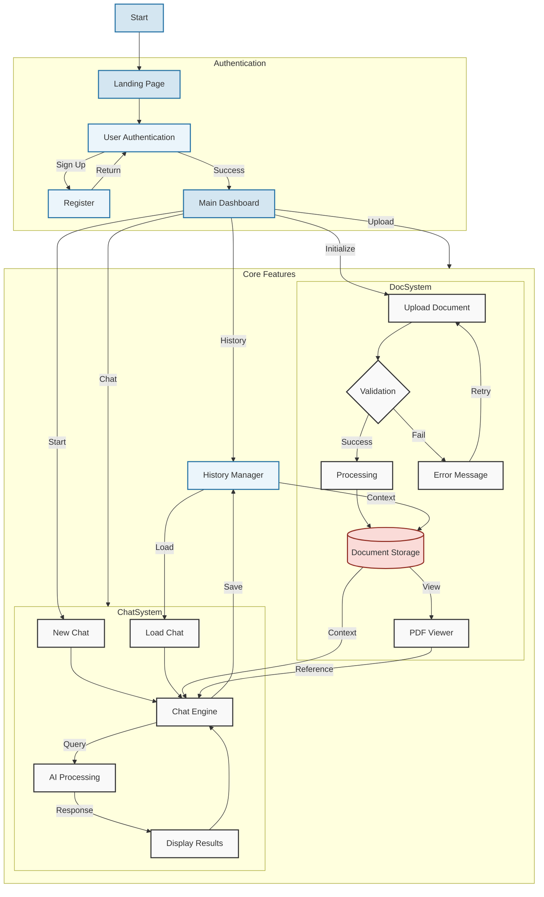

```mermaid
graph TD
    Start[Start] --> Landing[Landing Page]
    
    subgraph Auth[Authentication]
        Landing --> Login[User Authentication]
        Login -->|Sign Up| Register[Register]
        Register -->|Return| Login
        Login -->|Success| Dashboard[Main Dashboard]
    end
    
    subgraph Main[Core Features]
        Dashboard -->|Upload| DocSystem[Document System]
        Dashboard -->|Chat| ChatSystem[Chat System]
        Dashboard -->|History| HistoryMgr[History Manager]
        
        subgraph DocSystem
            Upload[Upload Document] --> Validate{Validation}
            Validate -->|Success| Process[Processing]
            Validate -->|Fail| Error[Error Message]
            Error -->|Retry| Upload
            Process --> Store[(Document Storage)]
            Store -->|View| PDFView[PDF Viewer]
        end
        
        subgraph ChatSystem
            NewChat[New Chat] --> ChatEngine[Chat Engine]
            LoadChat[Load Chat] --> ChatEngine
            ChatEngine -->|Query| AI[AI Processing]
            AI -->|Response| Display[Display Results]
            Display --> ChatEngine
        end
        
        %% System Connections
        Store -->|Context| ChatEngine
        PDFView -->|Reference| ChatEngine
        ChatEngine -->|Save| HistoryMgr
        HistoryMgr -->|Load| LoadChat
    end
    
    %% Cross-System Links
    Dashboard -->|Initialize| Upload
    Dashboard -->|Start| NewChat
    HistoryMgr -->|Context| Store

    %% Styling
    classDef default fill:#f9f9f9,stroke:#333,stroke-width:2px
    classDef primary fill:#d4e6f1,stroke:#2874a6,stroke-width:2px
    classDef secondary fill:#ebf5fb,stroke:#2874a6,stroke-width:2px
    classDef storage fill:#fadbd8,stroke:#943126,stroke-width:2px
    
    class Start,Landing,Dashboard primary
    class Login,Register,HistoryMgr secondary
    class Store storage
``` 